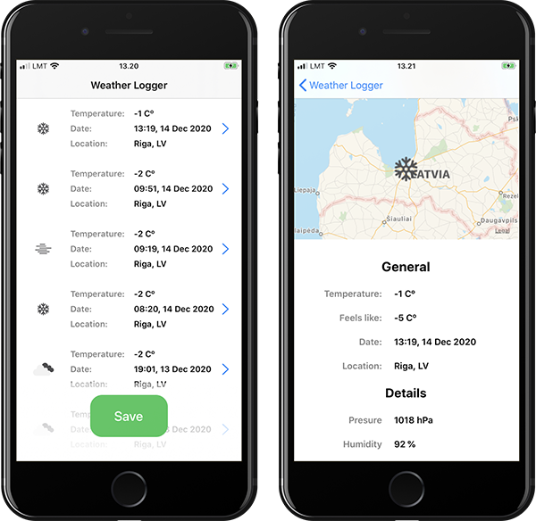

# WeatherLogger App

## Description:

Create an iOS application to save weather conditions for your current location.

## Main functionality:

* The weather information should be retrieved from [https://openweathermap.org/api](https://openweathermap.org/api) -> CurrentWeatherData API. This service returns a lot of data for a location, but it’s mandatory to save and display at least the temperature.
* Once ‘Save’ is pressed the application should retrieve the weather data from the API mentioned before, store it locally together with the date of the event (request time) and then display it on screen.

## Result

## What did I use

- [x] AutoLayout;
- [x] Local data storage;
- [x] CoreData;
- [x] Networking;
- [ ] Some combination of Swift and Objective-C;
- [ ] UI layout is handled for both iPad and iPhone;
- [x] More than one screen;
- [x] Some CRUD operations (Updating is not implemented) 
- [x] Ability to view weather details (the API returns more information than just the temperature);
- [ ] Unit tests;
- [x] UI tests (Added small one);
- [x] Custom animations, transitions;
- [x] Any funky iOS magic that you seem fit;
- [x] Dark/Light modes